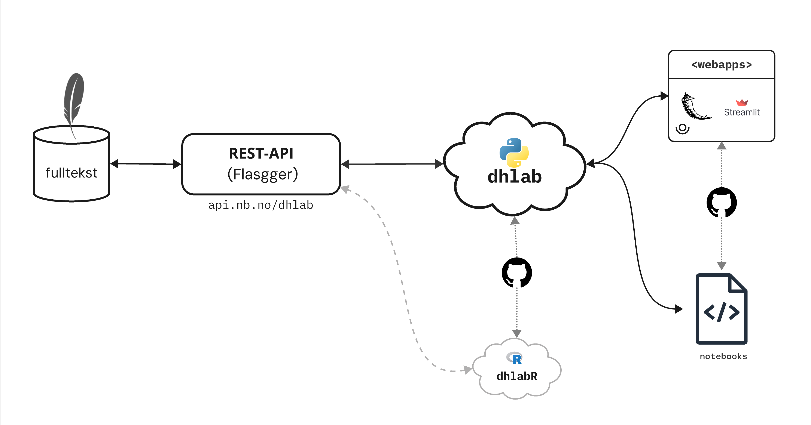
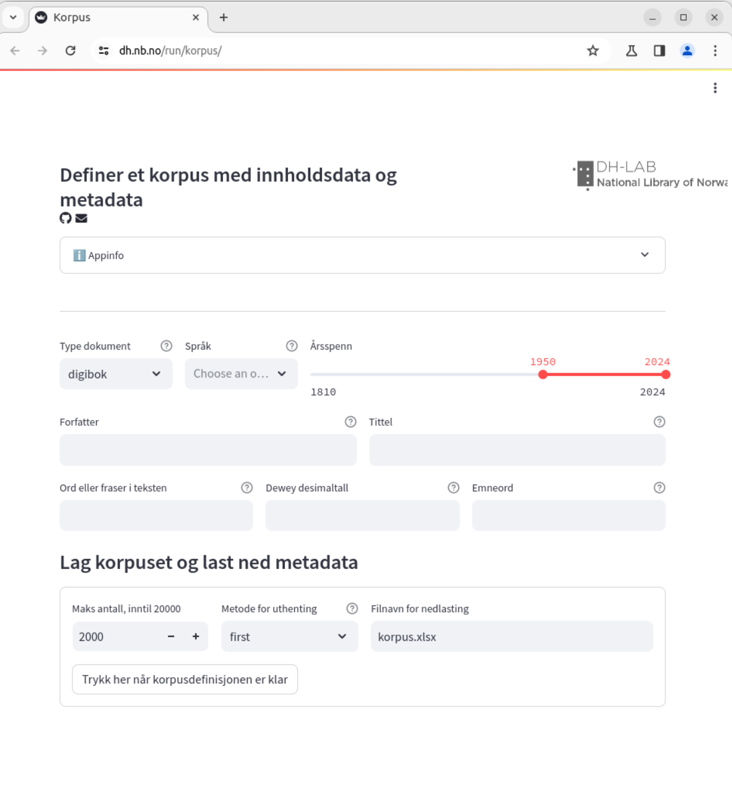

+++ {"slideshow": {"slide_type": "slide"}}

# Navigating Digital Landscapes

**Experiences from A Decade of Engaging with users of Digital Humanities**

---
[Digital Humanities Lab](https://www.nb.no/dh-lab/) at
[The National Library of Norway](https://www.nb.no/dh-lab/)

+++ {"slideshow": {"slide_type": "slide"}, "note": "Session 1: 45 min"}

## Ensuring data accessibility

* [FAIR Principles](#fair-principles)
* [Infrastructure and interoperability](#infrastructure-and-interoperability)
* [Text Digitization pipeline](#text-digitization-pipeline)

+++ {"slideshow": {"slide_type": "slide"}, "note": "LBJ \u2013 5 min"}

## [FAIR Principles](https://www.go-fair.org/fair-principles/)

Findable
: Metadata and data should be easy to find for both humans and computers, **indexed in a searchable resource** with **unique and persistent identifiers** and **rich metadata**.

Accessible
: (Meta)data can be retrieved by their identifier, and metadata are accessible even when the data are no longer available.

Interoperable
: (Meta)data should be easy to integrate with other data, applications, or workflows for analysis, storage and processing.

Reusable
: Data and metadata should should be well-described so that they can be replicated and/or combined in different settings.

---

[Wilkinson et al. 2016](doi:10.1038/sdata.2016.18)

+++ {"slideshow": {"slide_type": "slide"}, "note": "LBJ \u2013 10 min"}

## Infrastructure and interoperability

* Collaboration between Nordic countries on data
* Global identifiers

+++ {"slideshow": {"slide_type": "slide"}}

### Legal deposit and copyright

* Copyright law protects the right to use, publish, and distribute works.
* Documents published in Norway are deposited at the National Library, and made available for research and documentation purposes.
* The DH-lab has developed a range of tools and applications for analysing the digital documents, without infringing on copyright laws.

+++ {"slideshow": {"slide_type": "skip"}}

### Legal deposit vs. Copyright

Legal deposit
: All documents made publicly available in Norway must be deposited with the National Library of Norway, regardless of media type. ([Pliktavleveringslova](https://lovdata.no/dokument/NL/lov/1989-06-09-32))

Copyright
: The right to use, publish and distribute works is protected by copyright law. ([Åndsverkslova](https://lovdata.no/dokument/LTI/lov/2018-06-15-40))

+++ {"slideshow": {"slide_type": "slide"}, "note": "ILD & LBJ \u2013 15 min"}

## Text digitization pipeline

Book --> Scanned image --> OCR --> Fulltext --> Tokens --> Reduced representations  (e.g. frequency lists, ngrams, concordances, collocations) --> User interfaces (API, python, apps) + datasets (e.g. for training ML models, quantitative analyses)

+++ {"slideshow": {"slide_type": "slide"}, "note": "ILD & LBJ \u2013 15 min"}

## Digitalisation of published works

The National Library of Norway has digitalized most of the available documents and materials in its collection of published works.

Currently the digital library contains more than

* 640 000 books
* 4.5 million newspapers
* 2.4 million photographies
* 32 000 letters and handwritten scripts
* as well as maps, radio broadcasts, magazines, music notes etc.

+++ {"slideshow": {"slide_type": "slide"}, "note": "ILD"}

## Physical books, magazines, newspapers, and other publications

+++ {"slideshow": {"slide_type": "slide"}, "note": "ILD"}

## Large scale, high resolution image scanning

+++ {"slideshow": {"slide_type": "slide"}, "note": "ILD"}

## Optical Character Recognition

+++ {"slideshow": {"slide_type": "slide"}, "note": "Session 2: 60 min, LMT", "subtitle": "Session 2"}

## Creating User-Friendly Interfaces and Applications

* [API](https://api.nb.no/dhlab/)
* [python library](https://pypi.org/project/dhlab/)
* [R library](https://github.com/NationalLibraryOfNorway/dhlabR)
* [Web apps](https://www.nb.no/dh-lab/apper/)

+++ {"slideshow": {"slide_type": "skip"}}

:::{dropdown} Summary
This session explores the innovative approaches the National Library of Norway has adopted in creating user-friendly interfaces and applications for digital humanities projects.
We'll showcase our DH-lab app development methodology, which incorporates the use of Flask APIs and the dhlab Python library, alongside the integration of Streamlit for interactive, web-friendly applications.
With our indexed databases of digital texts, we have developed a suite of apps for analysing reduced representations of the data:

* Corpus construction: Lists of document IDs and their metadata

* N-gram statistics: Frequency counts of uni-, bi- and trigrams over time

* Concordances: Immediate contexts of specific search terms

* Collocations: Aggregated concordances, ranked by word similarity scores calculated with pointwise mutual information

The session will be a hands-on experience, inviting participants to navigate through these interfaces. This practical exploration aims to provide an immersive understanding of the user-centric design principles we've implemented over the years.
The apps are available from the National Library’s official website: <https://www.nb.no/dh-lab/apper/>
:::

<!-- summary end -->

+++ {"slideshow": {"slide_type": "slide"}}

## User Interfaces

+++ {"slideshow": {"slide_type": "slide"}}

## API

_Access to the DH-lab tools and methods_

+++ {"slideshow": {"slide_type": "slide"}}

## Python Library

<!-- LMT 15 min -->

Use the DH-lab Python library directly in Jupyter Notebooks:

[DHlab tutorial](https://nationallibraryofnorway.github.io/digital_tekstanalyse/tutorial.html)

+++ {"slideshow": {"slide_type": "slide"}}
## R library

TBC?

+++ {"slideshow": {"slide_type": "slide"}}

## Apps
<!-- LBJ, LMT 15 min -->

* [Corpus builder](#corpus)
* [N-gram statistics](#n-grams)
* [Concordances](#concordances)
* [Collocations](#collocations)
* More apps in the [DH-lab app gallery](https://www.nb.no/dh-lab/apper/)

+++ {"slideshow": {"slide_type": "slide"}}

### Corpus

_Construct a collection of document IDs and their metadata with a search interface_:

[dh.nb.no/run/korpus/](https://dh.nb.no/run/korpus/)

+++ {"slideshow": {"slide_type": "slide"}}

### N-grams

_Frequency counts of uni-, bi- and trigrams over time_:

[nb.no/ngram/](https://www.nb.no/ngram/#1_1_1__1_1_3_1810%2C2022_2_2_2_12_2)

+++ {"slideshow": {"slide_type": "slide"}}

### Concordances

_Immediate, word level contexts of specific search terms_:

[dh.nb.no/run/konkordans/](https://dh.nb.no/run/konkordans/)

+++ {"slideshow": {"slide_type": "slide"}}

### Collocations

_Aggregated concordances, ranked by word similarity scores calculated with pointwise mutual information_:

[dh.nb.no/run/kollokasjon/](https://dh.nb.no/run/kollokasjon/)

<!---  --->

+++ {"slideshow": {"slide_type": "slide"}}

## Break 10:00 - 10:30

+++ {"slideshow": {"slide_type": "slide"}}

Session 3:

## Combining Quantitative and Qualitative Methods

<!-- 45 min  -->

+++ {"slideshow": {"slide_type": "slide"}}

## Hermeneutic principles

<!-- LBJ, JS 10 min -->

+++ {"slideshow": {"slide_type": "slide"}}

## Collocations and discourse analysis

<!-- JS 10 min -->

+++ {"slideshow": {"slide_type": "slide"}}

## Historiography meets Algorithms

Alsvik and Munch-Møller [2020](https://www.idunn.no/doi/10.18261/issn.1894-3195-2020-03-03)

+++ {"slideshow": {"slide_type": "slide"}}

## The Rise of Health

**A Collocation Analysis of Conceptual Changes in News Discourse, 1950–2010**

Kveim Lie, Johnsen, Jordheim, and Ytreberg [2022](https://www.berghahnjournals.com/view/journals/contributions/17/2/choc170202.xml)

+++ {"slideshow": {"slide_type": "slide"}}

## Skjønnlitteraturen: en kroppsvisitasjon

Uri and Johnsen [2021](https://barnebokinstituttet.no/aktuelt/skjonnlitteraturen-en-kroppsvisitasjon/)

+++ {"slideshow": {"slide_type": "slide"}}

## Thank you for attending

Explore more DH-lab tools and methods from our website:

<https://www.nb.no/dh-lab/>

[Bibliography](https://nationallibraryofnorway.github.io/digital_tekstanalyse/bibliography/bibliography.html)
